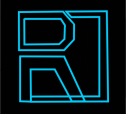

# RavnOS


RanvOS, (from norwegian; raven),  is a operative system programmed in Rust. Aims to be; minimal, stable, secure and modern ( this maybe you know as; state-of-art ).

Is my personal project to make from scratch an operative system, take this project as a hobby, nothing professional. 

## Target

The pillars of RavnOS are;

- Minimalism

Nothing of bloatware inside the code or system. Just the necessary to do the job (maximum viable product).

Also the minimalism affects the system's scope, check that point.

- Stability and security over features

Will have absolute priority the stability and security of the system over X feature. 

- Isolation and portability

Each part of system must be portable over Rust supported platforms.

Each part of system must be self hosted, no external crates (over internet) are allowed. All must be local.

Each part of system distributed in binary form must be done as static, at 2022 the best way for this is use MUSL standard C library.

- Keys - Data

The information is printed in screen and worked with syntax;

```
[key] {
	[data]
}
```

This allow work with data grouped by keys and avoid issues traying to extract data when it have "", '', \\, \\\, and others characters.

## Requirements 
- Rustc
- A terminal
- Cargo with the target toolchain you want/need:

 This is not mandatory but will help you to build with one just command.

- Musl target: 

This is not mandatory, but I recommend it to build as static.

## Versioning

The versioning schema for releases follows Semantic Versioning v2 ( https://semver.org/spec/v2.0.0.html ), here a resume;

```
Given a version number MAJOR.MINOR.PATCH, increment the:

    MAJOR version when you make incompatible API changes
    MINOR version when you add functionality in a backwards compatible manner
    PATCH version when you make backwards compatible bug fixes

Additional labels for pre-release and build metadata are available 
as extensions to the MAJOR.MINOR.PATCH format.
```

A change from early development is; each MINOR version also indicate each new / existing feature inside internal programs. And performance patches go to "PATCH" section instead "MINOR" section.

With this versioning schema you know that whitin each MAJOR version the system is always compatible with the oldest versions.

## Documentation

The files with documentation like; roadmap, issues, etc are;

- Documentation/ROADMAP.md

Contains information about ROADMAP for each release.

- Documentation/PATRONS.md

Contains information about each patrons in each month.

- Documentation/ISSUES.md

Contains information about each issue fixed.

- Documentation/PARTS.md

Contains information about each system part.

## Build

There are two ways for build RavnOS. ;

- Cargo

I recommend use this configuration inside "~/.cargo/.config";

```rust
[build]
target= "x86_64-unknown-linux-musl"
jobs=20
rustflags = ["-C","opt-level=2","-C","debuginfo=0","-C", "target-feature=+crt-static","-C","target-cpu=native"]
```

To build;

```rust
cargo build --release --target [x86_64/arm64/etc]-unknown-[linux/windows/etc]-musl
```

All binaries will be in "target/\[TARGET]/release".

If you have space requeriments, do "strip" to the final binaries. This is because even with "-\-release" target I still found debug symbols in the final binary.

- Rustc

For each RavnOS's lib you must first build them as object file and then can be used inside compilation process;

```rust
rustc --crate-type=rlib --crate-name libconfarg [PATH_TO_LIBCONFARG]/src/lib.rs -o libconfarg.rlib
rustc --crate-type=rlib --crate-name libstream [PATH_TO_LIBSTREAM]/src/lib.rs -o libstream.rlib
rustc --crate-type=rlib --crate-name libfile [PATH_TO_LIBFILE]/src/lib.rs -o libfile.rlib
```

Then you can link into the binary build;

```rust
rustc --target=[x86_64/arm64/etc]-unknown-[linux/windows/etc]-musl -C opt-level=2 -C target-feature=+crt-static --extern libconfarg=libconfarg.rlib --extern libfile=libfile.rlib --extern libstream=libstream.rlib [COMPONENT]/src/main.rs -o [final_name]
```

with above command, you will the final binary of [COMPONENT] in static final form (aka; statically linked) with optimization level 2 and specific libs (crates).

As with cargo, I reccomend do "strip" to the final binaries to delete debug symbols.

### Before - After strip binary

Before strip;
```bash
-rwxr-xr-x 2 shyanjmc shyanjmc 9.0M Oct 23 04:31 ls
```

After strip;
```bash
-rwxr-xr-x 2 shyanjmc shyanjmc 507K Oct 23 04:32 ls
```

The strip command clean the debug symbols, which are the 94.49869791666667% of space.

## License

RavnOS and all parts are licensed under GPLv3.

## Contact
If you want contact me, you can do it trough:

Email:

- shyanjmc@proton.me
- shyanjmc@protonmail.com
- joaquincrespo96@gmail.com

Linkedin:

- https://www.linkedin.com/in/joaquin-mcrespo/ 

## Contributions and support

For now I am the main and only dev in this project, maybe in the future I will allow collaborations. 

If you want support this project you can;

Join my patreon;

- https://patreon.com/shyanjmc

Donate me crypto;

- DAI (ERC-20) - The preferred stablecoin;

 0x27219354cC70dE84e7fae0B71E9e2605026b10B2

- Bitcoin (BTC); 

16n6GP4XkZiyoGCZei6uxdpohCkPm7eQ7L

- Ethereum (ETH); 

0x27219354cC70dE84e7fae0B71E9e2605026b10B2


Also you can donate trought crypto-coffee.xyz;

- https://crypto-coffee.xyz/donate/shyanjmc

And if you know me personally, let me know that you have donated, since that moment we will share a beer (or mead if you are man/women of honor).
